# Terraform × cloud-initでVMのセットアップをいい感じにする vol.1

---

## はじめに

どうも、ネットワークコンテンツ研究会に所属しております、[cyokozai](https://x.com/cyokozai0)と申します。
ここでは、ネットワークコンテンツ研究会のプロジェクトの一つであるNekkoCloudにIaCを導入し、NekkoCloudの環境構築の自動化を目的とします。
最近流行ってるじゃないですか、やれIaaSだのKaaSだのSaaSだの...。
私たちのNekkoCloudだってイカしたプロビジョニングツールを導入して、チームメンバーのみんなが自由に計算リソースを使える環境を用意したいんです！
ってことで、Proxmox VEのVM作成をTerraformとcloud-initを使って簡単にできるようにする、そんな感じのリポジトリです🌟  

### TL;DR

- Proxmox VEのVM構築をcloud-initとTerraformを利用して、簡略化かつIaC対応できるようにしたもの
- Proxmox VEにcloud-initをセットアップする方法の紹介
- Terraformの基本操作とtfstateを保護するための応用例

### [cloud-init][cloud-initを使ったLinux OSの初期設定]とは

上記の通りLinux OSのインスタンスの初期設定をいい感じに自動化してくれる優れもの。
GUIとCLIどちらでも設定可能👍
今回はTeraformのProxmox Providerを使って外部からUbuntuインスタンスの作成を目標にします。

### [Terraform][Terraformとは | IBM]とは

Terraformは今のIaC時代を支える最もスタンダードなプロビジョニングツールです。
IBMでは次のように紹介されています。

> Terraform は、クラウドおよびオンプレミスのリソースを安全かつ効率的に構築、変更、バージョン管理できるコード ツールとしてのインフラストラクチャです。

Application Programming Interfaces (APIs)が使えるほとんどのプラットフォームでTerraformは使用可能なんだとか。
すげー🙌

### Proxmox VEのVM作成をTerraformで自動化するメリット

ぶっちゃけ「デファクトスタンダードだから」と言いたいところではあるんですが、さすがにそれだけだとエライ人に怒られちゃうからね。
真面目にやります。  
今回の選定理由はこんな感じでしょうかね？  

- Proxmox Providerの豊富な機能  
  今回はTelmate/proxmoxをProviderとしてしようしています。
  バージョンは3.0.1-rc1です。
  RC版を使用している理由は、CloudInitの柔軟なコンフィグ設定を実装しているためです。
  今のところ動作に致命的な影響は出ていませんが、ロールバックも視野に入れつつ、CloudInitの恩恵を得るために今回選択しています。
- 冪等性の確保  
  私たちはProxmox VEに対してステートレスなVM構築を目的としています。
  特に注目したいのは、TerraformのState Lockingです。
  これは、複数のユーザがサーバに対して変更や操作を実行しようとしたときに、変更によるファイルの競合を防ぐ機能です。
  tfstateファイルにロックがかかると、他のユーザはそのtfstateファイルの変更はできないので、堅牢性に優れています。
  ここで冪等性については深堀りしませんが、気になる人は[コチラ][サーバーレスが気になる開発者に捧ぐ「べき等性」ことはじめ]の記事をお読みになってください。
- スケーラブルな変更  
  私たちが求めているのは、プログラムの関数のように引数に入れる値を変更するだけで、VMの仕様を変更できる「手軽さ」です。
  今回作成したtfファイルでは、所見の人がパラメータをいじくる場所を極力一か所に集中するように設計しています。
  OSの変更、CPUのコア数、メモリの容量、ストレージの大きさ...それらすべては変数の値を変えるだけで実現できる。
  ネットワークの設定やVMIDの紐づけ、SSHキーの保存、複数台のVMの同時デプロイ。
  Terraformが有している協力なプロビジョニング機能は、初めて車を納車した人のように、利用者の苦労を一気に解決してくれます。

---

## cloud-initの使い方

作成したIMGファイルからテンプレートを作成して、クローンすることでVMのセットアップの手間を省くことができる。
cloud-initはそれを可能にし、クラウドでのIaCを行う上では欠かせないツールである。
Proxmoxでcloud-initを使用し、各種VMのデプロイを自動化する。  
以下ではGUIとCLI両方の設定の仕方を紹介する。

### GUIで設定を行う場合

- Proxmox VEのGUIを開き、cloud-initを作成するノードのlocalを選択
- ISO Imagesを選択し、使用するISOファイル[Ubuntu server Cloudimg 22.04LTS](https://cloud-images.ubuntu.com/)をアップロードする
- 普段通りCreate VMを押してテンプレート用のVMを作成（ただし初回起動はまだしないように！bootのチェックも外しておく）
- VM.Hardwareを選択し、AddからCloudInit Driveを選択する

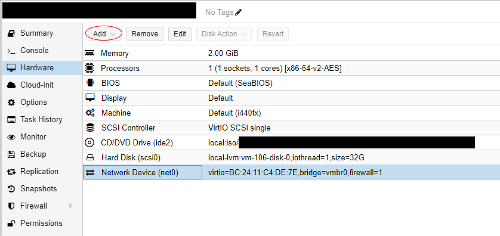

- cloud-initの保存先を選択する

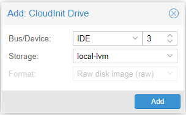

- VM.cloud-initを選択すると、編集可能になっている
- User, Password, IP Config（Gateway）を設定する

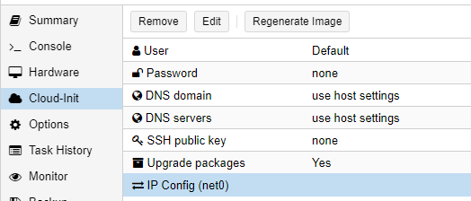

- 設定が完了したら、右上のMoreからConvert to Templateを選択してテンプレートを作成
- テンプレートが完成するとこんな感じの画面になる

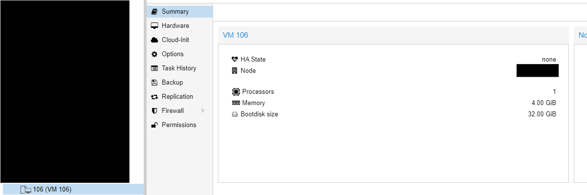

- Datacenterを選択。Permissions.Userを選択する
- Addをクリックして、Terraformを実行するためのユーザを新規作成する

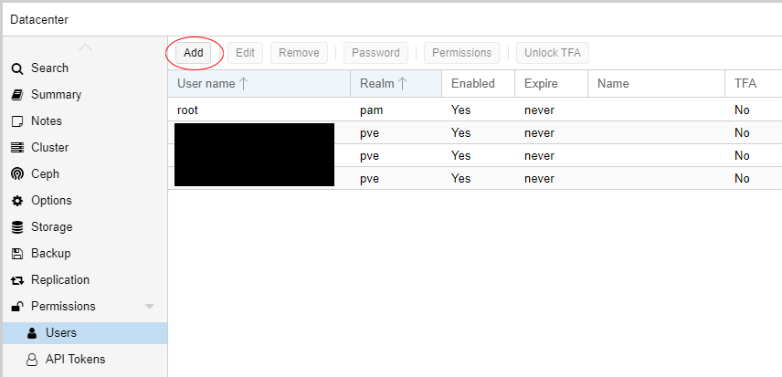

- 各種必要な項目を設定する（今回は適当にhogeを作成）

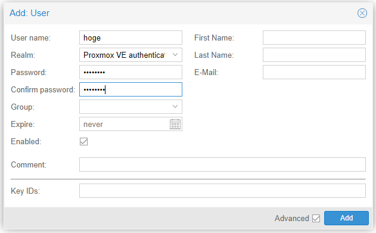

- 次に、Permissions.API Tokensへ移動し、同様にAddをクリックしてトークンの新規発行を行う
  
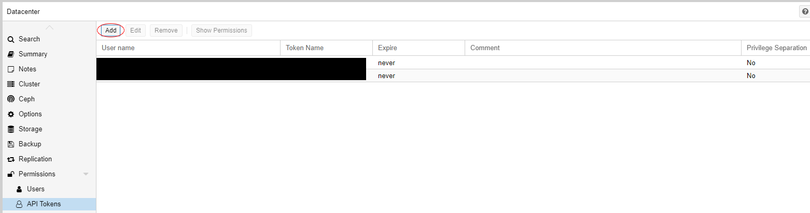

- 先程作成したユーザを選択し、任意のToken IDを入力する（今回はhogehoge）
- Privilege Separationのチェック欄を外しておく

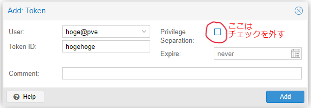

- 発行したTokenとSecretは`terraform.tfvars`の`PM_API_TOKEN_ID`と`PM_API_TOKEN_SECRET`へそれぞれ張り付けておく

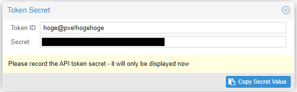

- Permissions.Rolesへ移動し、Createを選択
- 新たにTerraformProviderというロールを作成する
※この項目はCLIで行った方が楽ですね...

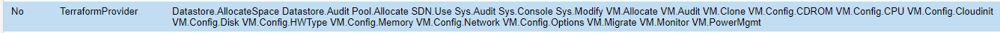

- 最後にPermissionへ移動し、Addを選択

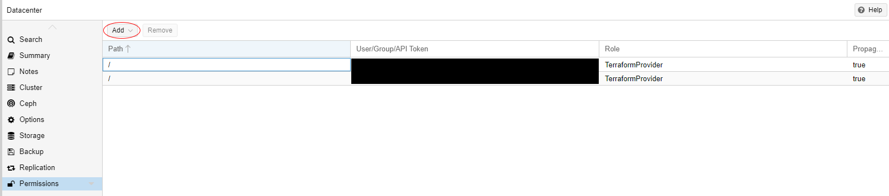

- Path（/）、ユーザ（hoge）、ロール（TerraformProvider）を選択する

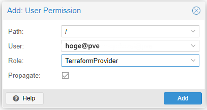

### CLIで設定を行う場合

- Proxmoxのノードに入り、VMに使用するイメージをダウンロードする
  今回使用したイメージは[Ubuntu server Cloudimg 22.04LTS](https://cloud-images.ubuntu.com/)
  
```bash
wget https://cloud-images.ubuntu.com/jammy/current/jammy-server-cloudimg-amd64.img -O ubuntu-22.04-server-cloudimg-amd64.img
```

- テンプレート用のVMを作成

```bash
qm create <VM ID> --memory 2048 --net0 virtio,bridge=vmbr0
```

- localのstorageにISOファイルをインポート

```bash
qm importdisk <VM ID> ubuntu-22.04-server-cloudimg-amd64.img local-lvm
```

- VMをセットアップ（nameserverはネットワークごとに任意のIPを設定）

```bash
qm set <VM ID> --scsi0 local-lvm:0,import-from=/root/ubuntu-22.04-server-cloudimg-amd64.img
qm set <VM ID> --name <VM Name>
qm set <VM ID> --scsihw virtio-scsi-pci --virtio0 local-lvm:vm-<VM ID>-disk-0
qm set <VM ID> --boot order=virtio0
qm set <VM ID> --ide2 local-lvm:cloudinit
qm set <VM ID> --nameserver 192.168.0.1
# qm set <VM ID> --nameserver 192.168.0.1 --searchdomain example.com
```

- VMテンプレートにコンバートする

```bash
qm template <VM ID>
```

---

## Terraformを使ってProxmoxのcloud-initから自動デプロイ

### Proxmoxクラスタの設定

[@ymbk990さんの記事][Proxmox VEとTerraformでインターン生に仮想マシンを払い出す話]を参考に、詳細な設定項目は`tfvars`にまとめるように作成します。

- Terraform用の新しいロール`TerraformProvider`を作成

```bash
pveum role add TerraformProvider -privs "Datastore.AllocateSpace Datastore.Audit Pool.Allocate Sys.Audit Sys.Console Sys.Modify VM.Allocate VM.Audit VM.Clone VM.Config.CDROM VM.Config.Cloudinit VM.Config.CPU VM.Config.Disk VM.Config.HWType VM.Config.Memory VM.Config.Network VM.Config.Options VM.Migrate VM.Monitor VM.PowerMgmt SDN.Use"
```

- 新しいユーザ`hoge@pve`を作成

```bash
pveum user add hoge@pve --password <password>
```

- ロール`TerraformProvider`をユーザ`hoge@pve`に追加

```bash
pveum aclmod / -user hoge@pve -role TerraformProvider
```

- `pvesh create /access/users/hoge@pve/token/hogehoge --privsep 0`を実行してトークンを発行
- 発行したTokenとSecretは`terraform.tfvars`の`PM_API_TOKEN_ID`と`PM_API_TOKEN_SECRET`へそれぞれ張り付けておく

```bash
$ pvesh create /access/users/hoge@pve/token/hogehoge --privsep 0
┌──────────────┬──────────────────────────────────────┐
│ key          │ value                                │
╞══════════════╪══════════════════════════════════════╡
│ full-tokenid │ hoge@pve!hogehoge                    │
├──────────────┼──────────────────────────────────────┤
│ info         │ {"privsep":"0"}                      │
├──────────────┼──────────────────────────────────────┤
│ value        │ xxxxxxxxxxxxxxxxxxxxxxxxxxxxxxxxxxxx │
└──────────────┴──────────────────────────────────────┘
```

### TerraformでVMをデプロイ

ここからは、このリポジトリをローカルにクローンしていることが前提です。  
ま、ここまで読んでくれた人はさすがにもうやってくれてるよね？😁👍

- `cd .\terraform`でtfファイルが保存されたディレクトリへ移動
- `terraform init`を実行して初期化
- `terraform init`は主に次のことを行う
> - providerの初期化
> - プラグインのダウンロード
> - backendの設定
> - moduleの初期化  
> [参考][Terraform面接質問集を作ってみた]

```bash
$ terraform init

Initializing the backend...
Initializing modules...

Initializing provider plugins...
- Reusing previous version of telmate/proxmox from the dependency lock file
- Using previously-installed telmate/proxmox v3.0.1-rc1

Terraform has been successfully initialized!

You may now begin working with Terraform. Try running "terraform plan" to see
any changes that are required for your infrastructure. All Terraform commands
should now work.

If you ever set or change modules or backend configuration for Terraform,
rerun this command to reinitialize your working directory. If you forget, other
commands will detect it and remind you to do so if necessary.
```

> [!important]
> Terraformでは、インフラストラクチャの状態を記録するtfstateファイルが存在します。
> このファイルは、プロビジョニングにおける作成リソースやプラグインの依存関係など重要な情報を含みます。  
> そして、致命的なのは、以前建てたtfstateファイルを保護せずに次のVMをデプロイしてしまうと、tfstateファイルが上書きされてしまい、結果現在動作しているVMを破壊した後に新たにVMをデプロイしてしまいます。  
> この現象を回避するには、予めtfstateファイルの保存先をプロジェクトごとに分けておく必要があります。
> TerraformのBackendオプションを使って初期化時に保存先を宣言すると、セキュアなプロビジョニングを実現できます。  
> 
> `terraform init -reconfigure -backend-config="path=tfstate/username/project-name.tfstate"`  
>
> `-reconfigure`は既存のtfstateファイルの有無に関係なく、設定を再構成します。
> `-backend-config`でtfstateファイルの保存先を設定します。

<details>
<summary>各種VMおよびリージョンの設定項目を記述する</summary>

  `backend.tf`の`local`にあるVMリソースの項目を適宜設定する

  - Argument reference
    - `onboot`: デプロイ時にそのまま起動する デフォルトは`true`
    - `storage_pool`: 使用するストレージ先　`cephfs` `local-lvm`から選択
  
  - VM config Ubuntu 22.04
    - `os_name`: OSの名前
    - `ci_name`: cloud-initで事前に作成したVMテンプレートの名前
    - `description`: 概要
    - `vmid`: Proxmox VMID
    - `clone_num`: Proxmoxクラスター上にデプロイされるVMの数
    - `cores`: VMのコア数（デフォルトは1）
    - `memory`: VMのメモリ数（デフォルトは2048MB）
    - `disk_size`: VMのストレージ（デフォルトは2252MB）

</details>

<details>
<summary>tfvarsの設定項目について</summary>

  `terraform.tfvars.template`を参考に内容を記述すること。
  
  - PROXMOX PROVIDER CONFIGURATION
    - `NC_REGION`: NekkoCloud PVE Regionの略語（幕張 => mk, 浦和 => ur, 津田沼 => tu）
    - `PM_API_TOKEN_ID`: # Permissions.API Tokensで作成したAPI Token
    - `PM_API_TOKEN_SECRET`: # Permissions.API Tokensで作成したAPI Secret
    - `PM_HOST_IP`: 各PVEリージョンのIPのホスト部（Number）
    - `NC_MK_IP`: 各PVEリージョンのIPのネットワーク部（XXX.XXX.XXX.）
    - `NC_UR_IP`: 各PVEリージョンのIPのネットワーク部（XXX.XXX.XXX.）
    - `NC_TU_IP`: 各PVEリージョンのIPのネットワーク部（XXX.XXX.XXX.）

  - VM CONFIGURATION
    - "vm_name": # VMの名前
    - "username": # VMにログインするユーザネーム
    - "password": # VMへのログイン時に必要なパスワード
    - "public_key": # SSH用の公開鍵

</details>

- `terraform plan`を実行してtfファイルに問題が無いか確認を行ってもらう
- `terraform apply`を実行してデプロイ  
  `yes`と入力して開始！  

```bash
$ terraform apply
Do you want to perform these actions?
  Terraform will perform the actions described above.
  Only 'yes' will be accepted to approve.

  Enter a value: yes

~~~

Apply complete! Resources: 1 added, 0 changed, 0 destroyed.
```

- VMを削除する場合は`terraform destroy`を実行する  
  `yes`と入力して開始！  

```bash
$ terraform destroy

~~~

Plan: 0 to add, 0 to change, 1 to destroy.

Do you really want to destroy all resources?
  Terraform will destroy all your managed infrastructure, as shown above.
  There is no undo. Only 'yes' will be accepted to confirm.

  Enter a value: yes

~~~

Destroy complete! Resources: 2 destroyed.
```


> [!important]
> `terraform apply / destroy`について、先程の`terraform init`同様にtfstateファイルの指定、およびtfstate.buckupの保存先を指定します。
> コマンドは以下のとおりです（`destroy`も同様）。
> 
> `terraform apply --auto-approve -state=tfstate/username/project-name.tfstate -backup=tfstate/username/project-name.tfstate.backup`
> 
> `--auto-approve`は変更確認の入力`yes`を省略します。
> `-state`は先程と同じtfstateファイルのパスを指定します。
> `-backup`はtfstate.backupを保存するためのパスを指定します。

---

## おわりに

ここまでお疲れ様でした！今日からあなたもNekkoCloudのリージョン管理者の仲間入りです🙌  
今回のIaC実装を経て、チームメンバーの作業効率の向上に関する課題は多く残っていると考えています。
チームメンバーが求めているものは、自由に触って好きなように作ったり壊したりできるVMを、いつでも使える環境ではないでしょうか？
IaC導入の一番のメリットは、インフラストラクチャの自動構築です。
これは、NekkoCloudの各リージョン管理者からの視点では一定水準をクリアしたと認識しています。
では、リージョン管理者以外のチームメンバーは、VMを作成するのに一からTerraformを学ぶ必要があるのでしょうか？
それは本来やりたいことからかけ離れた、あまりにも遠回りな選択肢なのです。  
とまあ、説教垂れててもこういった労苦（Toil: トイル）は消えて無くなったりしないので、一つずつテクノロジーを使って解決していきましょう。
今ここでチョロっと話した、いわゆる「ゴールデンパス」に関するお話は[コチラ][道を照らす: プラットフォーム エンジニアリング、ゴールデンパス、セルフサービスのパワー]の記事で詳しく述べています。  

ではでは、今後の開発にご期待ください！🫡  
そんじゃまた👋

[cyokozai](https://x.com/cyokozai0)

### 追伸

- cloud-initのテンプレートもワンクリックで作成できるようにしたいので、CloudConfig.yaml周りを調査中であります🫡  
- 現在DiscordBotでVMのデプロイを行うツールを開発中です。  
  他の開発メンバーも交えて、本格的にチームメンバーへのVMの払い出しを念頭に置いたシステム開発を行っています。  

**乞うご期待！！**

---

## 参考文献

1. [cloud-initを使ったLinux OSの初期設定]
2. [Proxmox VE cloud-init で Ubuntu 20.04 を起動する]
3. [Terraformとは | IBM]
4. [サーバーレスが気になる開発者に捧ぐ「べき等性」ことはじめ]
5. [Terraform面接質問集を作ってみた]
6. [Terraform のコマンド、オプションを出来るだけ使ってみる]
7. [Proxmox Provider]
8. [Terraform Registry]
9. [Proxmox VEとTerraformでインターン生に仮想マシンを払い出す話]
10. [Proxmox VEのcloudinitでuserdataを自由に調整する]
11. [道を照らす: プラットフォーム エンジニアリング、ゴールデンパス、セルフサービスのパワー]

[cloud-initを使ったLinux OSの初期設定]: https://qiita.com/yamada-hakase/items/40fa2cbb5ed669aaa85b
[Proxmox VEとTerraformでインターン生に仮想マシンを払い出す話]: https://qiita.com/ymbk990/items/bd3973d2b858eb86e334
[Terraformとは | IBM]: https://www.ibm.com/jp-ja/topics/terraform
[サーバーレスが気になる開発者に捧ぐ「べき等性」ことはじめ]: https://aws.amazon.com/jp/builders-flash/202104/serverless-idempotency/
[Terraform面接質問集を作ってみた]: https://qiita.com/to-fmak/items/9f3c00d478296f1ed9d2
[Terraform のコマンド、オプションを出来るだけ使ってみる]: https://qiita.com/takkii1010/items/082c0854fd41bc0b26c3
[Proxmox VE cloud-init で Ubuntu 20.04 を起動する]: https://blog.naa0yama.com/p/33w15-2j8gmw31/
[Proxmox VEのcloudinitでuserdataを自由に調整する]: https://ainoniwa.net/pelican/2021-08-10a.html
[Proxmox Provider]: https://registry.terraform.io/providers/Telmate/proxmox/latest/docs
[Terraform Registry]: https://registry.terraform.io/providers/Telmate/proxmox/latest/docs/resources/vm_qemu#disksxpassthrough-block
[道を照らす: プラットフォーム エンジニアリング、ゴールデンパス、セルフサービスのパワー]: https://cloud.google.com/blog/ja/products/application-development/golden-paths-for-engineering-execution-consistency
